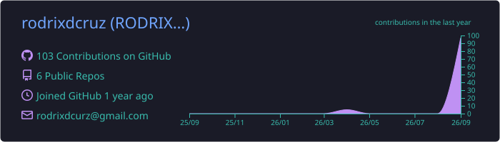
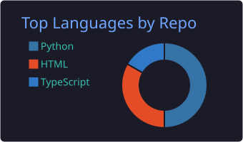

hey 👋 I'm Rodrix — I like building things that actually help people, especially when the weather doesn't cooperate.

### ▶ try them live

### 🌦️ MausamBagha AI

**[live demo](https://weathergpt-web.onrender.com)** · **[repo](https://github.com/rodrixdcruz/mausambagha-ai)** · **[v1.0.0](https://github.com/rodrixdcruz/mausambagha-ai/releases)**

A disaster decision-support app: live weather, an explainable risk engine, and AI chat that only answers from real data. Runs on entirely free, key-less services — no API bills, no quiet failures.

- 🗺️ finds nearby shelters and draws the actual walking/driving route in-app — routed through a cached backend OSRM proxy, so public traffic never hammers the free map API
- 🧠 local AI model first, free cloud tiers behind it — replies always cite where they came from
- 🎪 judge console that simulates floods, heatwaves and smog on live data, any season
- 🌐 speaks English, हिन्दी, and मराठी

*FastAPI · React · Leaflet · Three.js · Postgres · 405 tests · MIT*

### 🌱 other projects

- **[KisanProfit](https://github.com/rodrixdcruz/kisanprofit)** — farmer expense & profit tracker: real profit per crop, AI insights, voice entry, PDF/CSV reports. **[Try it live](https://kisanprofit-web.onrender.com)** — demo login 9999999999 / demo1234. English / हिन्दी / मराठी.
  *FastAPI · React · Postgres · 83 tests · v1.0.0*
- **[CropSmart](https://github.com/rodrixdcruz/cropsmart)** — AI crop advisory for Indian farmers: live-weather crop recommendation and daily mandi price trends with sell timing. **[Try it live](https://rodrixdcruz.github.io/cropsmart/)** — zero-install web app in English, हिन्दी, मराठी and தமிழ்.
  *Vanilla JS · GitHub Pages · v1.0.0*
- **[desktop-tutorial](https://github.com/rodrixdcruz/desktop-tutorial)** — where my GitHub journey started. Everyone keeps their first repo. 🙂

### 📊 GitHub stats

### 🐍 contributions forecast

rain-blue cells (light = drizzle, deep navy = downpour) and a lightning-yellow snake:

<picture>
  <source media="(prefers-color-scheme: dark)" srcset="https://raw.githubusercontent.com/rodrixdcruz/rodrixdcruz/output/github-snake-dark.svg" />
  
</picture>

Everything above, on one page → **[rodrixdcruz.github.io](https://rodrixdcruz.github.io)**

<!-- to publish: create a public repo named exactly "rodrixdcruz", put this file in it as README.md -->
